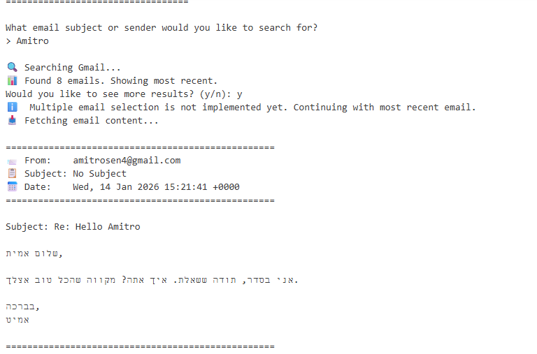
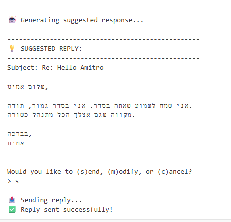
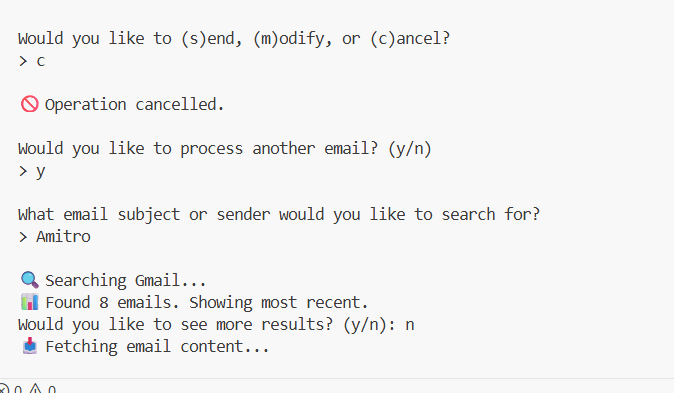

# 🤖 AI Email Assistant

An intelligent email automation tool that integrates Gmail API with OpenAI to help you manage and respond to emails efficiently.

## ✨ Features

### Core Capabilities
- 🔍 **Smart Email Search** - Search emails by subject or sender name
- 📧 **Email Content Display** - View complete email details (from, subject, date, body)
- 🤖 **AI-Powered Responses** - Generate contextual replies using OpenAI's GPT models
- ✏️ **Flexible Workflow** - Send, modify, or cancel responses before sending
- 🛡️ **Error Handling** - Graceful error management and user feedback
- 📊 **Multiple Results** - Handle and display multiple search results

### User Interfaces

#### Command Line Interface (CLI)
- Simple, guided workflow
- Perfect for quick email responses
- Keyboard-driven interaction

#### Web Interface
- Modern, interactive UI built with Reflex
- Visual email selection from search results
- Inline response editing
- Real-time status updates and loading indicators
- One-click sending

***

## 📸 Screenshots

### Command Line Interface

**Email Search and Response Generation:**


**AI-Generated Response:**


### Web Interface

**Full Application View:**


***

## 🚀 Quick Start

### Prerequisites

- Python 3.8 or higher
- Gmail account
- Google Cloud Project with Gmail API enabled
- OpenAI API key

### Installation

1. **Clone the repository**
   ```bash
   git clone https://github.com/YOUR_USERNAME/ai-email-assistant.git
   cd ai-email-assistant
   ```

2. **Create virtual environment**
   ```bash
   python -m venv venv
   
   # Activate it
   # Windows:
   venv\Scripts\activate
   # macOS/Linux:
   source venv/bin/activate
   ```

3. **Install dependencies**
   ```bash
   pip install -r requirements.txt
   ```

4. **Configure Google Cloud credentials** (see detailed setup below)

5. **Set up environment variables**
   ```bash
   cp .env.example .env
   # Edit .env with your API keys
   ```

## ⚙️ Configuration

### Google Cloud Setup

1. **Create Google Cloud Project**
   - Go to [Google Cloud Console](https://console.cloud.google.com/)
   - Create a new project or select existing one
   - Name it (e.g., "AI Email Assistant")

2. **Enable Gmail API**
   - Navigate to **APIs & Services > Library**
   - Search for "Gmail API"
   - Click **Enable**

3. **Configure OAuth Consent Screen**
   - Go to **APIs & Services > OAuth consent screen**
   - Choose **External** user type
   - Fill in:
     - App name: "AI Email Assistant"
     - User support email: your email
     - Developer contact: your email
   - Click **Save and Continue**
   - Skip Scopes
   - **Add Test Users**: Add your Gmail address
   - Click **Save**

4. **Create OAuth Credentials**
   - Go to **APIs & Services > Credentials**
   - Click **Create Credentials > OAuth client ID**
   - Choose **Desktop app**
   - Name it (e.g., "Gmail Desktop Client")
   - Click **Create**
   - Download JSON file
   - Rename it to `credentials.json`
   - Place it in the project root directory

### Environment Variables

Create a `.env` file:

```text
# OpenAI Configuration
OPENAI_API_KEY=your_openai_api_key_here
OPENAI_ORG_ID=your_organization_id_here  # Optional

# Gmail API Configuration (Optional - defaults provided)
GMAIL_CREDENTIALS_PATH=./credentials.json
GMAIL_TOKEN_PATH=./token.json

# OpenAI Model Settings (Optional)
OPENAI_MODEL=gpt-4o-mini
TEMPERATURE=0.7
MAX_TOKENS=500
```

## 💻 Usage

### Command Line Interface

```bash
python main.py
```

**First Run**: Browser will open for Gmail authentication:
1. Sign in with your Google account
2. If you see "Google hasn't verified this app", click **Advanced** → **Go to AI Email Assistant (unsafe)**
3. Grant Gmail permissions
4. Authentication saved for future runs

**Workflow**:
1. Enter email subject or sender name
2. Review email content
3. Check AI-generated response
4. Choose: `s` (send), `m` (modify), `c` (cancel)

### Web Interface

```bash
reflex run
```
Open browser to `http://localhost:3000`

## 🏗️ Project Structure

```text
ai-email-assistant/
├── main.py                 # CLI entry point
├── gmail_handler.py        # Gmail API integration
├── llm_handler.py          # OpenAI API integration
├── config.py               # Configuration management
├── web_ui.py               # Reflex web interface
├── requirements.txt        # Python dependencies
├── .env.example            # Environment template
├── .gitignore              # Git ignore rules
├── screenshots/            # Application screenshots
└── README.md               # This file
```

## 🛠️ Built With

- **Gmail API** - Email operations
- **OpenAI API** - AI response generation
- **Reflex** - Web UI framework
- **Python 3.8+** - Core language

## 🧪 Testing

Run the test script to verify setup:

```bash
python test_submission.py
```

### Manual Testing Scenarios
1. **Happy Path**: Search → Display → Generate → Send
2. **Email Not Found**: Invalid search → Error handling
3. **Modify Response**: Search → Modify → Send
4. **Cancel**: Search → Cancel
5. **Multiple Results**: Search common term → Browse results

## 🔒 Security

- OAuth 2.0 for Gmail authentication
- API keys stored in environment variables
- Credentials excluded from version control
- No hardcoded sensitive data

## 🤝 Contributing

Contributions are welcome! Feel free to:
1. Fork the repository
2. Create a feature branch (`git checkout -b feature/AmazingFeature`)
3. Commit your changes (`git commit -m 'Add some AmazingFeature'`)
4. Push to the branch (`git push origin feature/AmazingFeature`)
5. Open a Pull Request

## 📝 License

This project is licensed under the MIT License - see the [LICENSE](LICENSE) file for details.

## 🙏 Acknowledgments

- OpenAI for providing powerful language models
- Google for Gmail API
- Reflex team for the excellent web framework

## 📧 Contact

Your Name - [@your_twitter](https://twitter.com/your_twitter)

Project Link: [https://github.com/YOUR_USERNAME/ai-email-assistant](https://github.com/YOUR_USERNAME/ai-email-assistant)

## 🗺️ Roadmap

- [ ] Add support for multiple email accounts
- [ ] Implement email templates
- [ ] Add scheduling for delayed sending
- [ ] Support for email attachments
- [ ] Multi-language support
- [ ] Email categorization and prioritization
- [ ] Integration with other email providers (Outlook, etc.)
